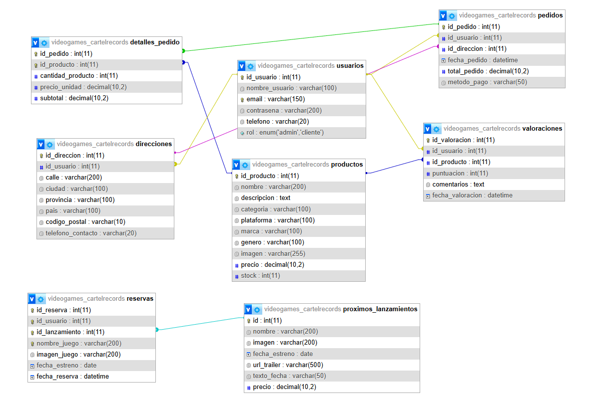

# Cartel Records Games — Tienda Online de Videojuegos

---

## 1. Portada

| Campo | Valor |
|---|---|
| **Título del proyecto** | Cartel Records Games — Tienda Online SPA de Videojuegos |
| **Ciclo Formativo** | Desarrollo de Aplicaciones Web (DAW) |
| **Centro educativo** | IES Suárez de Figueroa |
| **Autor** | Alberto Vázquez Rando |
| **Tutor** | José Manuel Carrasco Díaz |
| **Fecha de presentación** | Junio 2026 |
| **Repositorio** | [github.com/suarezfigueroa/2025-2026_AlbertoVazquez](https://github.com/suarezfigueroa/2025-2026_AlbertoVazquez) |

---

## 2. Índice

1. [Portada](#1-portada)
2. [Índice](#2-índice)
3. [Introducción](#3-introducción)
4. [Objetivos del proyecto](#4-objetivos-del-proyecto)
5. [Justificación del proyecto](#5-justificación-del-proyecto)
   - 5.1 [Análisis de mercado](#51-análisis-de-mercado)
   - 5.2 [Vinculación con el Ciclo Formativo](#52-vinculación-con-el-ciclo-formativo)
6. [Recursos utilizados](#6-recursos-utilizados)
   - 6.1 [Entornos de desarrollo](#61-entornos-de-desarrollo)
   - 6.2 [Lenguajes de programación](#62-lenguajes-de-programación)
   - 6.3 [Utilidades](#63-utilidades)
7. [Tecnologías de desarrollo](#7-tecnologías-de-desarrollo)
8. [Diseño del proyecto](#8-diseño-del-proyecto)
   - 8.1 [Diseño de la base de datos](#81-diseño-de-la-base-de-datos)
   - 8.2 [Diseño de la interfaz de usuario](#82-diseño-de-la-interfaz-de-usuario)
   - 8.3 [Roles de la aplicación](#83-roles-de-la-aplicación)
   - 8.4 [Usuarios creados para pruebas](#84-usuarios-creados-para-pruebas)
9. [Lógica y codificación del proyecto](#9-lógica-y-codificación-del-proyecto)
10. [Despliegue web del proyecto](#10-despliegue-web-del-proyecto)
11. [Manual de usuario](#11-manual-de-usuario)
12. [Conclusiones y aspectos a mejorar](#12-conclusiones-y-aspectos-a-mejorar)
13. [Bibliografía](#13-bibliografía)
- [Anexos](#anexos)

---

## 3. Introducción

**Cartel Records Games** es una tienda online de videojuegos, consolas y periféricos que he desarrollado como proyecto final del ciclo de DAW.

La idea surgió porque queria hacer algo que me motivara y que al mismo tiempo pusiera en práctica todo lo del ciclo: base de datos, backend en PHP, frontend en JavaScript y diseño CSS. Una tienda online me parecía lo suficientemente completa como para cubrir todo eso.

La he construido como una **SPA (Single Page Application)**, es decir, las secciones cambian sin recargar la página, igual que hacen aplicaciones como Gmail o Twitter. Esto lo implementé yo mismo con JavaScript puro, sin usar ningún framework como React o Vue.

El proyecto incluye catálogo de productos, carrito de compra, sistema de usuarios con login, gestión de pedidos, valoraciones de productos y un panel de administración para gestionar el inventario. También tiene una sección de próximos lanzamientos donde los usuarios pueden hacer reservas.

---

## 4. Objetivos del proyecto

Los objetivos principales del proyecto son:

- **Desarrollar una tienda online funcional** con catálogo de productos organizados por categorías (Videojuegos, Consolas, Periféricos).
- **Implementar una arquitectura SPA** con enrutamiento propio en JavaScript sin uso de frameworks externos.
- **Crear un sistema de autenticación** con sesiones PHP para usuarios registrados y administradores.
- **Desarrollar una API REST** en PHP que sirva datos en formato JSON al frontend.
- **Gestionar el carrito de compra** de forma persistente mediante `localStorage`.
- **Implementar un sistema de pedidos** completo con historial y gestión de direcciones de envío.
- **Añadir un sistema de valoraciones** con puntuación por estrellas y comentarios, vinculados a compras verificadas.
- **Diseñar una interfaz responsive** adaptada a móviles, tablets y escritorio.
- **Crear un panel de administración** para la gestión CRUD de productos.

---

## 5. Justificación del proyecto

### 5.1 Análisis de mercado

El sector del videojuego lleva años siendo uno de los más grandes del entretenimiento y sigue creciendo. Las grandes tiendas como GAME o Amazon tienen catálogos enormes pero son plataformas cerradas y genéricas. Las tiendas digitales como Steam directamente no venden físico ni periféricos.

| Plataforma | Lo que tiene | Lo que le falta |
|---|---|---|
| GAME.es | Tienda consolidada con físico y online | No es personalizable, es una plataforma cerrada |
| Amazon | Catálogo enorme | No está especializada en videojuegos |
| Steam | Muy buena para digital | No vende físico ni periféricos |
| Fnac.es | Multi-categoría | Experiencia demasiado genérica |

La idea de **Cartel Records Games** es que pueda servir como base para una tienda pequeña o de nicho que quiera tener su propia web con gestión propia, valoraciones verificadas por compra y sección de reservas para próximos lanzamientos.

### 5.2 Vinculación con el Ciclo Formativo

Este proyecto integra contenidos trabajados a lo largo del ciclo DAW:

| Módulo | Aplicación en el proyecto |
|---|---|
| **Desarrollo Web en Entorno Cliente** | SPA con router propio en JavaScript, manipulación del DOM, eventos, `fetch` API, `localStorage` |
| **Desarrollo Web en Entorno Servidor** | API REST en PHP, sesiones, PDO, consultas preparadas |
| **Bases de Datos** | Diseño E/R, modelo relacional, SQL (DDL y DML), consultas con JOIN |
| **Diseño de Interfaces Web** | CSS3 avanzado, Flexbox, Grid, diseño responsive, animaciones |
| **Lenguajes de Marcas** | HTML5 semántico, estructura de documentos, formularios |
| **Sistemas Informáticos** | Despliegue con XAMPP (Apache + MySQL), gestión de archivos en servidor |

---

## 6. Recursos utilizados

### 6.1 Entornos de desarrollo

| Herramienta | Uso |
|---|---|
| **Visual Studio Code** | Editor principal de código (HTML, CSS, JS, PHP) |
| **XAMPP** | Servidor local Apache + MySQL/MariaDB |
| **phpMyAdmin** | Gestión visual de la base de datos |
| **Google Chrome DevTools** | Depuración de JS, inspección de CSS, responsive testing |

### 6.2 Lenguajes de programación

| Lenguaje | Parte del proyecto | Finalidad |
|---|---|---|
| **PHP 8** | Backend (`/api/`, `/conexion/`, `index.php`) | API REST, autenticación, sesiones, consultas a BD |
| **JavaScript (ES2022)** | Frontend (`/carrito/`, `/home/`, `/videojuegos/`, etc.) | SPA router, lógica de vistas, carrito, valoraciones |
| **HTML5** | Vistas (`/vistas/`, `index.php`) | Estructura semántica del contenido |
| **CSS3** | (`style.css`, `responsive.css`, módulos por sección) | Estilos, animaciones, diseño responsive |
| **SQL** | (`/BD/videogames_cartelrecords.sql`) | Definición de tablas, datos de prueba |

### 6.3 Utilidades

| Recurso | URL | Uso |
|---|---|---|
| Google Fonts | https://fonts.google.com | Tipografías (Arial/sistema como base) |
| MDN Web Docs | https://developer.mozilla.org | Referencia de APIs web (fetch, localStorage, etc.) |
| PHP.net | https://www.php.net/docs.php | Documentación oficial PHP y PDO |
| Can I Use | https://caniuse.com | Compatibilidad CSS entre navegadores |
| GitHub Docs | https://docs.github.com | Formato Markdown para esta documentación |
| Favicon/Iconos | Recursos propios (emojis Unicode) | Iconografía de la interfaz |

---

## 7. Tecnologías de desarrollo

### PHP + PDO
Usé PHP para todo el backend porque es el lenguaje de servidor que hemos trabajado durante el ciclo y me sentía cómodo con él. Para conectar con la base de datos usé PDO con consultas preparadas, que evita que se cuelen inyecciones SQL.

### MySQL / MariaDB
La base de datos la gestioné con MySQL a través de XAMPP. Diseñé las tablas desde cero en phpMyAdmin y luego exporté el script SQL para poder reproducir la BD fácilmente.

### JavaScript Vanilla (SPA Router)
Decidí no usar ningún framework (React, Vue...) porque quería entender cómo funciona realmente una SPA por dentro. Implementé el router en `router.js` usando `fetch()` para cargar las vistas y `history.pushState` para que la URL cambie sin recargar la página.

### localStorage
El carrito lo guardé en `localStorage` para que los productos no desaparezcan al recargar o cambiar de página. Se sincroniza con la BD solo en el momento de hacer el pedido.

### Fetch API
Toda la comunicación entre el frontend y el backend va por `fetch()` con respuestas JSON. Es básicamente como tener una API REST propia.

### CSS3 — Flexbox y Grid
No usé Bootstrap ni Tailwind, todo el CSS es propio. Flexbox para los layouts de fila (header, carrito) y Grid para las cuadrículas de productos.

---

## 8. Diseño del proyecto

### 8.1 Diseño de la base de datos

#### Diagrama Entidad/Relación




**Entidades y relaciones:**

- **USUARIOS** → se relaciona con PEDIDOS, VALORACIONES, DIRECCIONES y RESERVAS
- **PEDIDOS** → vinculado a USUARIOS, DIRECCIONES y DETALLES_PEDIDO
- **DETALLES_PEDIDO** → tabla intermedia entre PEDIDOS y PRODUCTOS
- **PRODUCTOS** → referenciado por DETALLES_PEDIDO y VALORACIONES
- **VALORACIONES** → relaciona USUARIOS con PRODUCTOS (reseñas)
- **DIRECCIONES** → pertenecen a USUARIOS, se usan en PEDIDOS
- **RESERVAS** → vinculada a USUARIOS y a PROXIMOS_LANZAMIENTOS (mediante `id_lanzamiento` FK)
- **PROXIMOS_LANZAMIENTOS** → catálogo de juegos aún no lanzados; los usuarios pueden reservarlos

#### Modelo Relacional

```
usuarios(id_usuario PK, nombre_usuario, email, contrasena, telefono, rol)

productos(id_producto PK, nombre, descripcion, categoria, plataforma,
          marca, genero, imagen, precio, stock, es_novedad)

pedidos(id_pedido PK, id_usuario FK→usuarios, id_direccion FK→direcciones,
        fecha_pedido, total_pedido, metodo_pago)

detalles_pedido(id_pedido FK→pedidos, id_producto FK→productos,
                cantidad_producto, precio_unidad, subtotal)

valoraciones(id_valoracion PK, id_usuario FK→usuarios,
             id_producto FK→productos, puntuacion, comentarios, fecha_valoracion)

direcciones(id_direccion PK, id_usuario FK→usuarios,
            calle, ciudad, provincia, pais, codigo_postal, telefono_contacto)

reservas(id_reserva PK, id_usuario FK→usuarios,
         id_lanzamiento FK→proximos_lanzamientos,
         nombre_juego, imagen_juego, fecha_estreno, fecha_reserva, metodo_pago)

proximos_lanzamientos(id PK, nombre, imagen, fecha_estreno,
                      url_trailer, texto_fecha, precio)
```

> El script SQL completo con la definición de tablas (DDL) y datos de prueba (DML) se encuentra en `/BD/videogames_cartelrecords.sql`.

### 8.2 Diseño de la interfaz de usuario

La interfaz sigue un diseño **oscuro tipo "gaming"** con los siguientes elementos visuales:

- **Paleta de colores**: Fondo `#0a0015` (negro azulado), acento principal `#6c3df7` (violeta), dorado `#FFD700` para destacados.
- **Header fijo**: Logo + navegación SPA + iconos de usuario/carrito + menú hamburguesa en móvil.
- **Barra de navegación rápida** (Home): Pills de acceso directo a secciones (Novedades, Más Vendidos, Reservas).
- **Carrusel de novedades**: Slider automático en la Home con los productos destacados.
- **Grid de tarjetas**: Sistema de tarjetas de producto con efecto hover, badge de stock y botones de acción.
- **Página de producto**: Vista completa con imagen sticky, badges de categoría/plataforma/marca, especificaciones técnicas y sección de valoraciones.
- **Drawer del carrito**: Panel lateral deslizante con items del carrito y total.
- **Panel de administración**: Tabla de gestión de productos con modal de edición/creación.

**Capturas de pantalla:**

> *(Añadir imágenes en `/img/` de la documentación y enlazarlas aquí)*

### 8.3 Roles de la aplicación

| Rol | Permisos |
|---|---|
| **Visitante** (no registrado) | Ver catálogo, ver detalle de productos, ver valoraciones. No puede comprar ni valorar. |
| **Usuario registrado** | Todo lo anterior + añadir al carrito, realizar pedidos, ver historial de pedidos, gestionar perfil y direcciones, dejar valoraciones en productos comprados. |
| **Administrador** | Todo lo anterior + acceso al panel de administración: crear, editar y eliminar productos; ver todos los pedidos. |

### 8.4 Usuarios creados para pruebas

| Usuario (Login) | Email | Contraseña | Rol |
|---|---|---|---|
| Admin | admin@gmail.com | admin123 | Administrador |
| kiko | kikooo@gmail.com | 1234567890 | Usuario registrado |

> ⚠️ Estos usuarios están incluidos en el script SQL de datos de prueba (`/BD/videogames_cartelrecords.sql`).

---

## 9. Lógica y codificación del proyecto

### Principales procesos

#### Arquitectura SPA y Router

El archivo `router.js` gestiona toda la navegación de la aplicación. Las vistas se cargan dinámicamente con `fetch()` desde la carpeta `/vistas/` y se inyectan en el elemento `<main id="contenido-principal">`:

```javascript
async function cargarVista(nombre, pushHistory = true) {
    const res = await fetch(rutas[nombre], { cache: 'no-store' });
    const html = await res.text();
    document.querySelector("#contenido-principal").innerHTML = html;
    if (pushHistory) {
        history.pushState({ vista: nombre }, '', '#' + nombre);
    }
    // Llamar función de inicialización de cada vista
    if (nombre === "videojuegos") initVideojuegos();
    // ...
}
```

#### Sistema de carrito

El carrito se almacena en `localStorage` como array JSON. Cada operación (añadir, eliminar, modificar cantidad) actualiza el array y re-renderiza el drawer lateral:

```javascript
function añadirAlCarrito(id, nombre, precio, imagen) {
    let carrito = JSON.parse(localStorage.getItem('carrito') || '[]');
    const existe = carrito.find(item => item.id == id);
    if (existe) {
        existe.cantidad++;
    } else {
        carrito.push({ id, nombre, precio: parseFloat(precio), imagen, cantidad: 1 });
    }
    localStorage.setItem('carrito', JSON.stringify(carrito));
    actualizarCarritoUI();
}
```

#### API REST PHP

Cada sección tiene su endpoint en `/api/`. Todos devuelven JSON y usan PDO con consultas preparadas:

```php
// api/videojuegos.php
$sql = "SELECT * FROM productos WHERE categoria = 'Videojuegos'";
$stmt = $conexion->prepare($sql);
$stmt->execute();
echo json_encode($stmt->fetchAll(PDO::FETCH_ASSOC));
```

#### Sistema de valoraciones

Las valoraciones solo pueden ser escritas por usuarios que hayan comprado el producto. La API verifica esto antes de permitir el INSERT:

```php
// Verificar si ha comprado el producto
$sqlCompra = "SELECT COUNT(*) FROM detalle_pedido dp
              JOIN pedidos p ON dp.id_pedido = p.id_pedido
              WHERE p.id_usuario = :uid AND dp.id_producto = :pid";
```

### Aspectos relevantes de la implementación

#### Validación de datos
- **Frontend**: Validación de formularios con JavaScript (campos requeridos, formato email, longitud de contraseña).
- **Backend**: Validación y sanitización en PHP antes de cualquier operación en base de datos. Se usa `intval()`, `trim()`, y `htmlspecialchars()`.

#### Control de acceso
Las rutas protegidas verifican la sesión PHP en el servidor. El frontend también comprueba `window.SESION` (inyectado desde PHP) para mostrar u ocultar elementos de la interfaz.

```php
// Protección de endpoints de admin
if (!isset($_SESSION['rol']) || $_SESSION['rol'] !== 'admin') {
    http_response_code(403);
    echo json_encode(['error' => 'Acceso denegado']);
    exit;
}
```

## 10. Despliegue web del proyecto

### Requisitos hardware

| Componente | Mínimo recomendado |
|---|---|
| Servidor web | Apache 2.4+ |
| PHP | PHP 8.0+ |
| Base de datos | MySQL 5.7+ / MariaDB 10.4+ |
| RAM servidor | 512 MB |
| Almacenamiento | 500 MB (incluyendo imágenes) |

### Servidores utilizados

El proyecto está desarrollado y probado en entorno local con **XAMPP** (Apache + MariaDB + PHP). Para un despliegue en producción se requeriría un hosting compartido o VPS con soporte PHP y MySQL.

**Pasos para el despliegue local:**

1. Instalar XAMPP en el equipo.
2. Copiar la carpeta del proyecto en `C:/xampp/htdocs/`.
3. Importar el archivo `/BD/videogames_cartelrecords.sql` en phpMyAdmin.
4. Configurar las credenciales de BD en `/conexion/conexion.php`.
5. Acceder a `http://localhost/PROYECTO/index.php`.

### Seguridad

- Contraseñas almacenadas con hash (`password_hash()` de PHP con algoritmo bcrypt).
- Consultas SQL parametrizadas con PDO para prevenir SQL Injection.
- Validación de sesión en cada endpoint protegido.
- Archivo `.env` para variables de entorno sensibles (credenciales BD).
- Sanitización de entradas con `htmlspecialchars()` para prevenir XSS.

---

## 11. Manual de usuario

> El manual de usuario completo se encuentra en el documento **[manual_usuario.md](./manual_usuario.md)**.

### Resumen de uso — Usuario registrado

1. Acceder a la tienda en `index.php`.
2. Navegar por las secciones (Videojuegos, Consolas, Periféricos) usando el menú superior.
3. Hacer clic en **"Ver más"** en cualquier producto para ver su ficha completa con especificaciones.
4. Pulsar **"Añadir al carrito"** para añadir productos.
5. Abrir el carrito con el icono 🛒 del header.
6. Proceder al checkout, introducir dirección de envío y confirmar el pedido.
7. Consultar pedidos anteriores en **Mi cuenta → Mis pedidos**.
8. Dejar valoraciones en productos ya comprados desde la página de detalle del producto.

### Resumen de uso — Administrador

1. Iniciar sesión con una cuenta de rol administrador.
2. Acceder al panel **Admin** desde el header.
3. Gestionar el catálogo: crear nuevos productos, editar existentes o eliminarlos.
4. Cada producto admite: nombre, descripción (con formato especificaciones usando `|`), precio, stock, imagen, categoría, plataforma, marca y género.

---

## 12. Conclusiones y aspectos a mejorar

### Conclusiones

Hacer este proyecto ha sido bastante exigente, sobre todo al principio cuando tuve que decidir cómo estructurarlo todo sin usar frameworks. Implementar el router SPA desde cero fue lo que más me costó: entender cómo funciona `history.pushState`, por qué se pierden los eventos al cambiar de vista y cómo gestionar correctamente el botón atrás del navegador.

Otra parte complicada fue el diseño responsive con el header fijo y la barra de navegación rápida, que en móvil se solapaban con el contenido. Tuve que coordinar CSS y JavaScript para que funcionara bien en todos los tamaños.

En general estoy satisfecho con el resultado. La aplicación funciona como una tienda real, con login, carrito, pedidos, valoraciones y panel de admin. Si tuviera más tiempo le añadiría una pasarela de pago real y un sistema de notificaciones por email.

### Aspectos a mejorar

- **Pasarela de pago real**: Actualmente el checkout simula el pago. Integrar una pasarela como Stripe o PayPal sería el siguiente paso natural.
- **Sistema de búsqueda global**: Añadir un buscador que filtre por todas las categorías a la vez.
- **PWA (Progressive Web App)**: Convertir la aplicación en una PWA con Service Worker para que funcione sin conexión.
- **Notificaciones por email**: Enviar confirmación de pedido al usuario por email (PHP Mailer o similar).
- **Tests automatizados**: Añadir tests unitarios para las APIs PHP y tests de integración para el frontend.

---

## 13. Bibliografía

| Recurso | URL |
|---|---|
| MDN Web Docs — fetch API | https://developer.mozilla.org/es/docs/Web/API/Fetch_API |
| MDN Web Docs — History API | https://developer.mozilla.org/es/docs/Web/API/History_API |
| MDN Web Docs — localStorage | https://developer.mozilla.org/es/docs/Web/API/Window/localStorage |
| PHP Manual — PDO | https://www.php.net/manual/es/book.pdo.php |
| PHP Manual — Sessions | https://www.php.net/manual/es/book.session.php |
| PHP Manual — password_hash | https://www.php.net/manual/es/function.password-hash.php |
| CSS Tricks — Flexbox Guide | https://css-tricks.com/snippets/css/a-guide-to-flexbox/ |
| CSS Tricks — Grid Guide | https://css-tricks.com/snippets/css/complete-guide-grid/ |
| Can I Use | https://caniuse.com |
| W3Schools — SQL | https://www.w3schools.com/sql/ |
| GitHub — Markdown Syntax | https://docs.github.com/es/get-started/writing-on-github |

---

## Anexos

### Anexo I — Script SQL de la base de datos

El script completo de creación de la base de datos (DDL + datos de prueba DML) se encuentra en:

```
/BD/videogames_cartelrecords.sql
```

Incluye:
- Creación de la base de datos `videogames_cartelrecords`.
- Creación de todas las tablas con sus restricciones (PRIMARY KEY, FOREIGN KEY, NOT NULL).
- Datos de prueba: productos de las tres categorías, usuarios de prueba, valoraciones de ejemplo.

### Anexo II — Formato de especificaciones de producto

Los productos admiten un formato especial en el campo `descripcion` para mostrar fichas técnicas:

```
Descripción general del producto || Clave1: Valor1 | Clave2: Valor2 | Clave3: Valor3
```

**Ejemplo real (PlayStation 5):**
```
La consola de nueva generación de Sony con gráficos 4K y carga ultrarrápida || CPU: AMD Zen 2 8 núcleos | GPU: AMD RDNA 2 | RAM: 16 GB GDDR6 | Almacenamiento: SSD 825 GB | Resolución: hasta 8K | FPS: hasta 120fps
```

El parser en JavaScript (`renderizarDescripcionProducto`) detecta automáticamente el formato y renderiza la descripción y las especificaciones en secciones separadas con estilos diferenciados.
